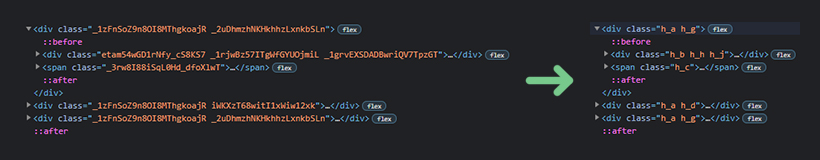

<div align="center">

# css-loader-incremental-ident

[](https://www.npmjs.com/package/css-loader-incremental-ident)
[](https://www.npmjs.com/package/css-loader-incremental-ident)
[](https://www.npmjs.com/package/css-loader-incremental-ident)
[](https://github.com/xobotyi/css-loader-incremental-ident/actions)
[](https://app.codecov.io/gh/xobotyi/css-loader-incremental-ident)
[](https://www.npmjs.com/package/css-loader-incremental-ident)

</div>

---

Webpack `css-loader`'s `getLocalIdent` implementation that will shrink your css-modules classnames
to the smallest possible size.



## Why

By default, `css-loader` generates quite long classnames, you can shorten them for production,
setting `localIdentName` option to `[hash:base64:5]`, but this approach contains theoretical
collisions.  
Yes, it is hard to imagine css with `1 073 741 824` classnames, but the _chance_ is way beyond
tolerable for me.

Provided implementation is absolutely collision-safe, as each processed classname will have its own
unique name.

## Install

```shell
npm i -D css-loader-incremental-ident
# or
yarn add -D css-loader-incremental-ident
```

## Configure

```js
const { createLocalIdentGetter } = require("css-loader-incremental-ident");

module.exports = {
  module: {
    rules: [
      {
        // config for css modules
        test: /\.scss$/,
        use: [
          {
            loader: MiniCssExtractPlugin.loader,
          },
          {
            loader: "css-loader",
            options: {
              importLoaders: 3,
              modules: {
                localIdentName: "[path][name]__[local]",
                getLocalIdent: createLocalIdentGetter({ bypass: !isProduction }),
              },
              sourceMap: !isProduction,
            },
          },
          "sass-loader",
        ],
        include: /\.module\.scss$/,
      },
    ],
  },
};
```

Below config uses classnames mangling for production build only, development build uses long
classnames for the sake of classnames obviousity.

### Options

```js
createLocalIdentGetter(options);
```

**options.alphabet**

- Type: `string`
- Default: `abcdefghijklmnopqrstuvwxyzABCDEFGHIJKLMNOPQRSTUVWXYZ1234567890`

Alphabet that is used for classnames generation. `-` and `_` characters are omitted as they mostly
used as separators, but you can add them to alphabet manually.

**options.bypass**

- Type: `boolean`
- Default: `false`

Bypass classname mangling, useful for separation between development and production builds. In case
this option set to `true`, `createLocalIdentGetter` will return `undefined` instead of function,
this will force `css-loader` to use default getter.

**options.prefix**

- Type: `string`
- Default: `""`

Character to prepend to each classname.

**options.suffix**

- Type: `string`
- Default: `""`

Character to append to each classname.

**options.localIdentSeparator**

- Type: `string`
- Default: `_`

Generated classname consist of two parts `[resoirceId]{localIdentSeparator}[localId]`.
`[resoirceId]` is the file id where classname takes its origin, it is unique over whole the
bundle. `[localId]` is the classname id, it is unique within single resource.
